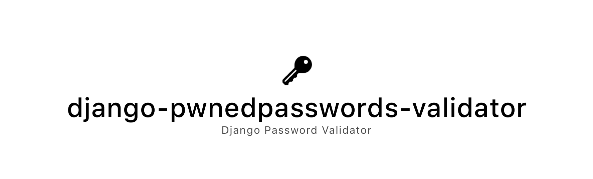

|image0| |image1|

|Version| |Python Versions|

``django-pwnedpasswords-validator`` is a Django password validator that
checks if a user-provided password exists in a data breach using the
`Pwned Passwords v2
API <https://haveibeenpwned.com/API/v2#PwnedPasswords>`__. All provided
password data is
`k-anonymized <https://en.wikipedia.org/wiki/K-anonymity>`__ before
being sent to the API, so plaintext passwords never leave your server.

From https://haveibeenpwned.com/API/v2#PwnedPasswords:

    Pwned Passwords are more than half a billion passwords which have
    previously been exposed in data breaches. The service is detailed in
    the `launch blog
    post <https://www.troyhunt.com/introducing-306-million-freely-downloadable-pwned-passwords/>`__
    then `further expanded on with the release of version
    2 <https://www.troyhunt.com/ive-just-launched-pwned-passwords-version-2>`__.
    The entire data set is `both downloadable and searchable online via
    the Pwned Passwords page <https://haveibeenpwned.com/Passwords>`__.

Installation
------------

django-pwnedpasswords-validator is available for download through
`PyPi <https://pypi.python.org/pypi/django-pwnedpasswords-validator>`__.
You can install it right away using pip.

.. code:: bash

    pip install django-pwnedpasswords-validator

Then, add django-pwnedpasswords-validator to your ``INSTALLED_APPS``:

.. code:: python

    INSTALLED_APPS = (
        ...
        'django_pwnedpasswords_validator'
    )

Finally, add django-pwnedpasswords-validator to
``AUTH_PASSWORD_VALIDATORS``:

.. code:: python

    AUTH_PASSWORD_VALIDATORS = [
        ...
        {
            'NAME': "django_pwnedpasswords_validator.validation.PwnedPasswordValidator"
        }
    ]

If you’d like to customize the error message (the default is *“This
password has previously appeared in a data breach and should not be
used.”*), you can pass in an alternate in the ``OPTIONS`` parameter for
the validator.

.. code:: python

    AUTH_PASSWORD_VALIDATORS = [
        ...
        {
            'NAME': "django_pwnedpasswords_validator.validation.PwnedPasswordValidator",
            'OPTIONS': {
                'error_text': "Your password was found in a data breach.",
            }
        }
    ]

Security Note
^^^^^^^^^^^^^

No plaintext passwords ever leave your server using
django-pwnedpasswords-validator.

How does that work? Well, the Pwned Passwords v2 API has a pretty cool
`k-anonymity <https://en.wikipedia.org/wiki/K-anonymity>`__
implementation.

From
https://blog.cloudflare.com/validating-leaked-passwords-with-k-anonymity/:

    Formally, a data set can be said to hold the property of
    k-anonymity, if for every record in a released table, there are k −
    1 other records identical to it.

This allows us to only provide the first 5 characters of the SHA-1 hash
of the password in question. The API then responds with a list of SHA-1
hash suffixes with that prefix. On average, that list contains 478
results.

People smarter than I am have used
`math <https://blog.cloudflare.com/validating-leaked-passwords-with-k-anonymity/>`__
to prove that 5-character prefixes are sufficient to maintain
k-anonymity for this database.

In short: your plaintext passwords are protected if you use this
library. You won’t leak any enough data to identity which passwords
you’re searching for.

Thanks
------

Special thanks to `Troy Hunt <https://www.troyhunt.com>`__ for
collecting this data and providing this service.

Authors
-------

`Dan Loewenherz <https://github.com/dlo>`__

See also
--------

`pwnedpasswords <https://github.com/lionheart/pwnedpasswords>`__, a
command-line utility and Python library for the Pwned Passwords v2 API.

License
-------

Apache License, Version 2.0. See `LICENSE <LICENSE>`__ for details.

.. |Version| image:: https://img.shields.io/pypi/v/django-pwnedpasswords-validator.svg?style=flat
   :target: https://pypi.python.org/pypi/django-pwnedpasswords-validator
.. |Python Versions| image:: https://img.shields.io/pypi/pyversions/django-pwnedpasswords-validator.svg?style=flat
   :target: https://pypi.python.org/pypi/django-pwnedpasswords-validator
